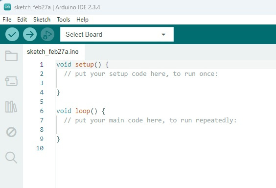
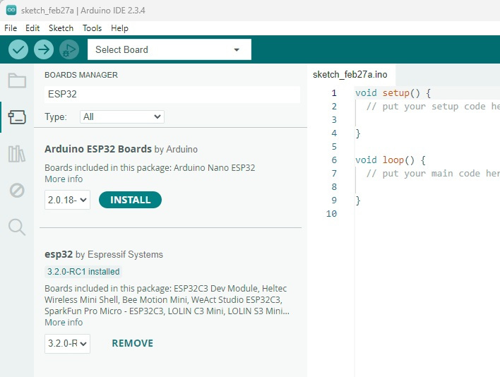
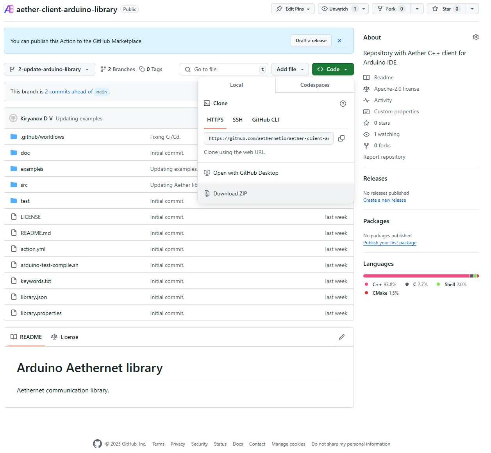
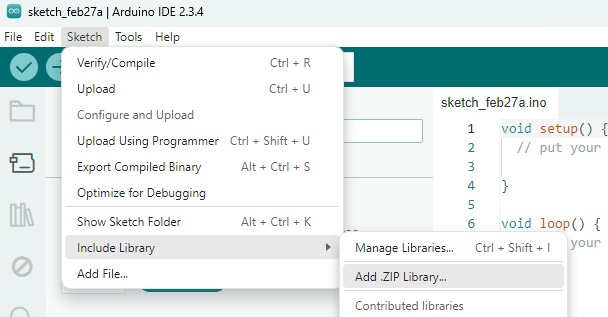
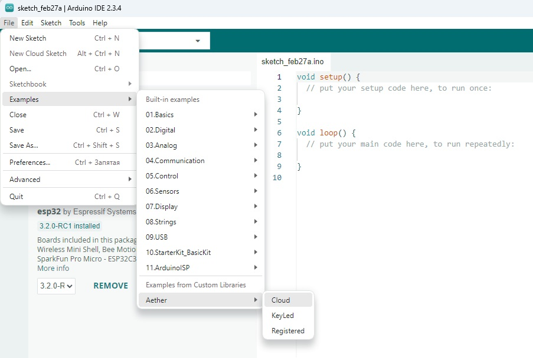
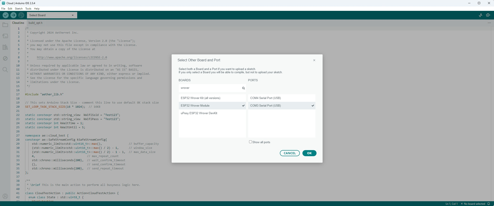
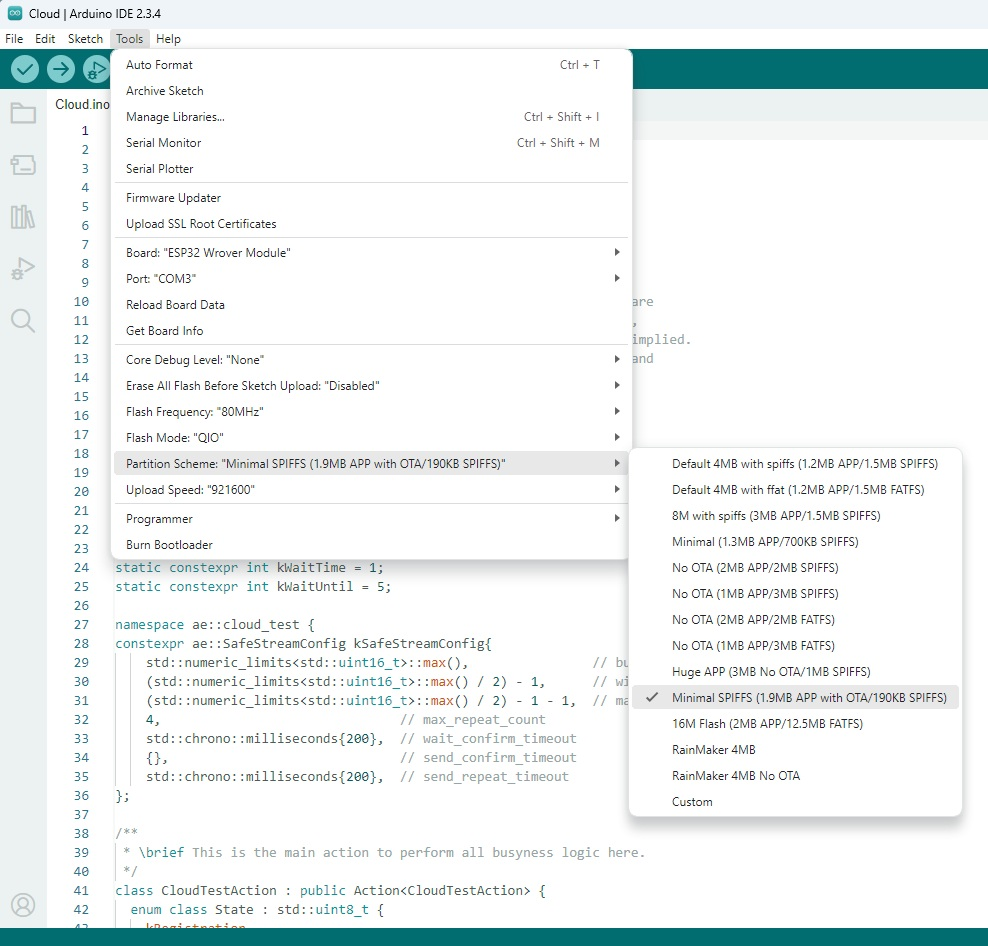

# Aethernet C++ client

Please reffer to [aethernet.io](https://aethernet.io) for documentation.

[Examples](https://github.com/aethernetio/aethernet-examples) of integrations into C++ and Java projects.

Install the Arduino IDE.

In the Board Manager, find and install the esp32 by Espressif Systems package.

Download the library as a zip file from this repository.

Install the library by selecting the menu item Sketch->Include Library->Add .ZIP Library...

If the installation is successful, you will see the message "Library installed"
Load example by selecting the menu item File->Examples->Aether->[Example]

Select your Board. For example ESP32 Wrover. And put your WiFi session ID and password.

Select the Partition Scheme Minimal SPIFFS. This example includes all logs and registration module with the binary footpring around 1.5 Mb

Now you're ready to build, upload and run the example. The log contains all messages starting with "Hello, it's me".
