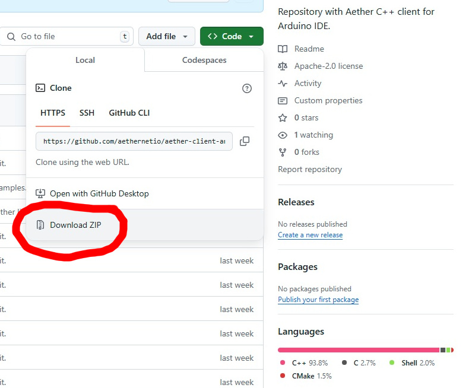
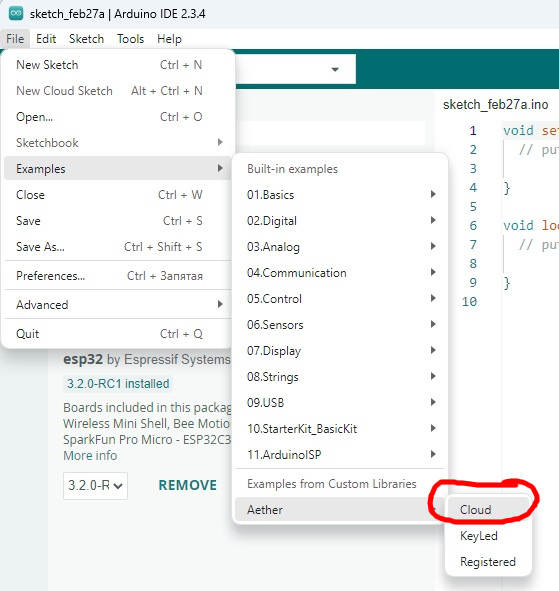
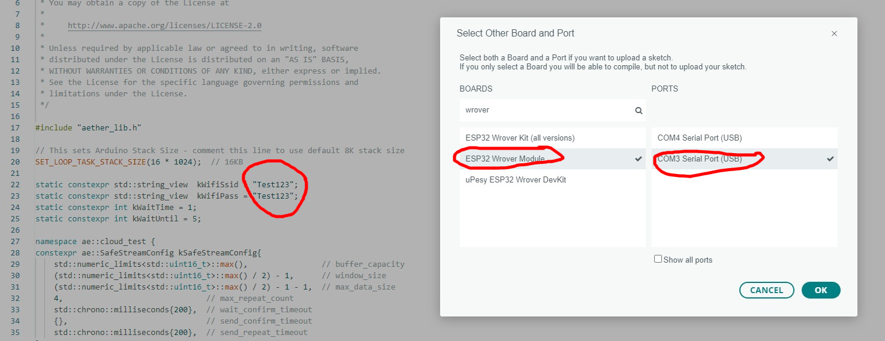
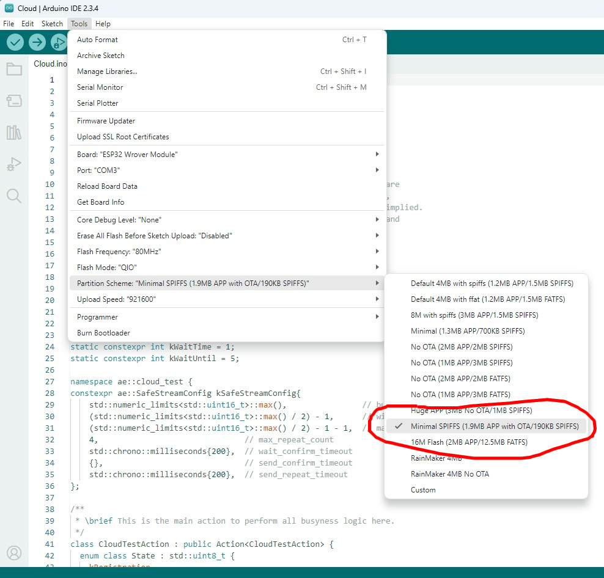

# Aethernet C++ client

Please reffer to [aethernet.io](https://aethernet.io) for documentation.

[Examples](https://github.com/aethernetio/testbed) of integrations into C++ and Java projects.

Install the Arduino IDE.

In the Board Manager, find and install the esp32 by Espressif Systems package.

Download the library as a zip file from this repository.

Install the library by selecting the menu item Sketch->Include Library->Add .ZIP Library...

If the installation is successful, you will see the message "Library installed"
Load example by selecting the menu item File->Examples->Aether->[Example]

Select your Board. For example ESP32 Wrover.

Select the Partition Scheme Minimal SPIFFS.

Register clients, using Registrator software. Push the "Verify" button.

After sucess compilation, push the "Upload" button.
